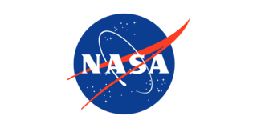

# **Asteroids - NeoWs**

NeoWs (Near Earth Object Web Service) is a RESTful web service for near earth Asteroid information. With NeoWs a user can: search for Asteroids based on their closest approach date to Earth, lookup a specific Asteroid with its NASA JPL small body id, as well as browse the overall data-set.

Data-set: All the data is from the NASA JPL Asteroid team.

### **Neo - Feed**

Retrieve a list of Asteroids based on their closest approach date to Earth.
`
GET https://api.nasa.gov/neo/rest/v1/feed?start_date=START_DATE&end_date=END_DATE&api_key=API_KEY
`

#### **Query Parameters**

|Parameter |Type |Default| Description|
|---|---|---|---|
|start_date |YYYY-MM-DD |none| Starting date for asteroid search|
| end_date |YYYY-MM-DD |7 days after start_date |Ending date for asteroid search|
|api_key |string |DEMO_KEY| api.nasa.gov key for expanded usage|

Example query

https://api.nasa.gov/neo/rest/v1/feed?start_date=2015-09-07&end_date=2015-09-08&api_key=DEMO_KEY

### **Authentication**

You do not need to authenticate in order to explore the NASA data. However, if you will be intensively using the APIs to, say, support a mobile application, then you should sign up for a [NASA developer key.](https://api.nasa.gov/#signUp)

Web Service Rate Limits

Limits are placed on the number of API requests you may make using your API key. Rate limits may vary by service, but the defaults are:

**Hourly Limit:** 1,000 requests per hour

For each API key, these limits are applied across all api.nasa.gov API requests. Exceeding these limits will lead to your API key being temporarily blocked from making further requests. The block will automatically be lifted by waiting an hour. If you need higher rate limits, contact us.

DEMO_KEY Rate Limits

In documentation examples, the special DEMO_KEY api key is used. This API key can be used for initially exploring APIs prior to signing up, but it has much lower rate limits, so you’re encouraged to signup for your own API key if you plan to use the API (signup is quick and easy). The rate limits for the DEMO_KEY are:

**Hourly Limit**: 30 requests per IP address per hour

**Daily Limit**: 50 requests per IP address per day

How Do I See My Current Usage?

Your can check your current rate limit and usage details by inspecting the `X-RateLimit-Limit` and `X RateLimit-Remaining` HTTP headers that are returned on every API response. For example, if an API has the default hourly limit of 1,000 request, after making 2 requests, you will receive this HTTP header in the response of the second request:
`X-RateLimit-Remaining: 998`
The hourly counters for your API key reset on a rolling basis.

**Example**: If you made 500 requests at 10:15AM and 500 requests at 10:25AM, your API key would become temporarily blocked. This temporary block of your API key would cease at 11:15AM, at which point you could make 500 requests. At 11:25AM, you could then make another 500 requests.

*Anyone can register for an api.nasa.gov key, which can be used to access data across federal agencies.*